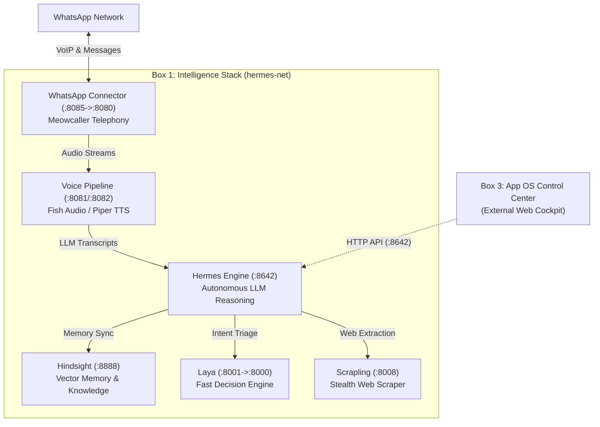

# Central AI — Hermes Intelligence & Superpowers Stack (Box 1)

This repository contains the standalone **Box 1: Core Intelligence Engine & Telephony Stack** of Central AI.

It is designed for direct, 1-click deployment in Coolify or any Docker Compose environment.

---

## 🏗️ Box 1 Architecture



---

## 📦 Services Included

| Service | Port | Description |
| :--- | :--- | :--- |
| **`hermes`** | `:8642` | Autonomous AI reasoning engine powered by OpenRouter / LLMs. |
| **`hindsight`** | `:8888` | Continuous long-term vector memory and knowledge graph. |
| **`laya`** | `:8001` (internal `:8000`) | Ultra-fast (~30ms) local CPU intent classification and guardrails. |
| **`whatsapp-connector`** | `:8085` (internal `:8080`) | Meowcaller VoIP & message bridge for WhatsApp. |
| **`scrapling`** | `:8008` | Headless, anti-bot web scraper with MCP interface. |
| **`voice`** | `:8081` & `:8082` | Real-time speech synthesis (Jarvis voice) via Fish Audio and Piper TTS. |

---

## 🚀 1-Click Deployment on Coolify

### Step 1: Add Public Repository Resource
1. In your Coolify dashboard, navigate to your Project/Environment.
2. Click **+ Add Resource** (or **+ New**).
3. Select **Public Repository**.
4. Configure the repository:
   * **Repository URL**: `https://github.com/brigada26/Central-AI-Hermes`
   * **Branch**: `main`
   * **Build Pack**: **Docker Compose**
   * *(Docker Compose location will automatically detect `docker-compose.yml`)*

### Step 2: Configure Environment Variables
Copy `.env.example` into the Coolify **Environment Variables** tab:

```env
# Core AI Credentials
HERMES_API_KEY=hermes_standalone_secret_token_32chars
OPENROUTER_API_KEY=sk-or-v1-your-openrouter-key-here

# Decoupled Model Architecture
HERMES_CHAT_PROVIDER=openrouter
HERMES_CHAT_MODEL=nousresearch/hermes-4-405b
WHATSAPP_CHAT_MODEL=deepseek/deepseek-v4.1-flash
HERMES_VOICE_MODEL=meta-llama/llama-3.3-70b-instruct

# Unified Voice Engine (Jarvis Voice)
FISH_API_KEY=your_fish_audio_api_key_here
FISH_VOICE_ID=612b878b113047d9a770c069c8b4fdfe
```

### Step 3: Click Deploy
Coolify will clone the repository, build all custom Dockerfiles (`deploy/hermes/Dockerfile`, `deploy/laya/Dockerfile`, and `deploy/whatsapp/Dockerfile.caller`), and start the stack with zero manual intervention.

---

## 🔒 Security & Decoupling Policy
* **Zero Database Bindings**: Box 1 does not access or store database credentials. State and profiles are managed by Box 3.
* **Internal Network Isolation**: The voice pipeline and internal ports communicate strictly inside `hermes-net`.
